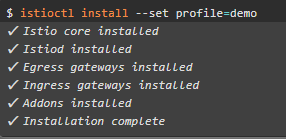
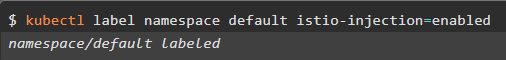

# Demostración de la aplicabilidad de Istio en un Cluster K8s

**Disclaimer**: Este repositorio contiene una copia de Istio, todos los archivos han sido descargados del [GitHub Oficial de Istio](https://github.com/istio/istio/releases) y pertenecen a sus respectivos autores.

Esta demo es un acercamiento al concepto de Service Mesh en un Cluster de K8s usando Istio y el Dashboard Kiali.

Usaremos Istio para administrar configuraciones al Load Balancer, crear rutas entre servicios, realizar transiciones ágiles entre versiones de un servicio y visualizar nuestro Service Mesh con Kiali.

## 📑 Tabla de contenido

1. [Requisitos](#-requisitos)
2. [Hands On!](#-hands-on)<br>
   2.1 [Configuración de Istio en IKS](#)<br>
   2.2 [Despliegue de la aplicación](#-despliegue-de-la-aplicacion)<br>
   2.3 [Dashboard Kiali](#dashboard-kiali)
3. [Referencias y documentación útil](#referencias-y-documentación-util)

## 📑 Requisitos

- Tener un servicio **[Kubernetes Cluster (IKS)](https://cloud.ibm.com/kubernetes/clusters)** disponible en la cuenta IBM Cloud.

  **Importante:** Debe ser un Cluster **pago** en plan **Standard**

- :cloud: [IBM Cloud CLI](https://cloud.ibm.com/docs/cli?topic=cloud-cli-getting-started&locale=en)
- :whale: [Docker](https://www.docker.com/products/docker-desktop)
- [kubectl](https://kubernetes.io/docs/tasks/tools/install-kubectl/). La version de esta herramienta debe ser compatible con la version de IKS que se desplegó en la cuenta.
- Complemento [container-service/kubernetes-service](https://cloud.ibm.com/docs/cli?topic=cli-install-devtools-manually) para ibmcloud CLI. `ibmcloud plugin install container-service/kubernetes-service`

## :hand: Hands On!

### Sección 1: Configuración de Istio en IKS

**Paso 1:** Clonar este repositorio y configurar las variables de entorno de nuestro ambiente.

Nos ubicamos en la carpeta del repositorio usando `cd Demo_Istio`

Linux o OSX: `export PATH=$PWD/bin:$PATH`

Windows: Escribimos el siguiente comando en PowerShell

```powershell
$path = [Environment]::GetEnvironmentVariable('PATH', 'User')
$ruta = $PWD
$newpath = $path + $ruta +'\bin'
[Environment]::SetEnvironmentVariable("PATH", $newpath, 'User')
```

**Paso 2:** Configuración de nuestro Cluster IKS

Recuerde llenar el campo <nombre_cluster> con el nombre de su cluster

`ibmcloud cs cluster config --cluster <nombre_cluster>`

**Paso 3:** Instalar Istio en nuestro cluster

Para efectos de esta demo definimos el perfil demo incluido en el repositorio

Usando el comando `istioctl install --set profile=demo` se instalará y configurará Istio en nuestro Cluster.

<p align=center></p>

**Paso 4:** Habilitar la inyección automática de Istio al Envoy Sidecar de nuestro cluster

Esto se realiza para un namespace determinado, en este caso usaremos el namespace por defecto

`kubectl label namespace default istio-injection=enabled`

<p align=center></p>

### Sección 2: Despliegue de la aplicación
